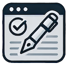

# Let's Sign and Verify

## Overview

Still relying on unverified pdfs and screenshots as official documents? Let's fix that!

Let's build a program to enable the widescale adoption of digital signing and verification of PDF documents on the internet. And let's use technology that we already have! 

Make PDF docs [#OfficialDocs](#official-documentation)!

This program implements [DEC-03](https://github.com/dgc-cgn/DEC/blob/main/challenges/dec-03.md) and takes after the inspirational success of [Let's Encrypt](https://letsencrypt.org/), a free service provided by the [Internet Security Research Group (ISRG)](https://www.abetterinternet.org/). This program, originally entitled **Domain Name Signature Provider (DNSP) Program** is now called **Let's Sign and Verify**.

If we achieve our goal, anyone will be able to verify the authenticity of a digitally signed PDF simply by retrieving the public key of the website owner has claimed to have signed the document. It will become just as easy a secure `https` connection. And no changes are required on the website!

If you wish to participate please contact [info@dgc-cgn.org](mailto:info@dgc-cgn.org). More details are below.
For every website domain name that has been issued a TLS certificate, the website owner can digitally sign for verification purposes any PDF document using the same public key of already issued website TLS certificate. 

## What's the Key Innovation?
The key innovation in the Let's Sign and Verify program lies in decoupling the signature validation process within a PDF document from the certificate validation embedded in the document. Unlike traditional methods that rely on a certificate authority for the chain of trust, this program introduces a novel approach: extracting the public key from the certificate embedded in the PDF and comparing it to the public key of the TLS certificate associated with the verifying domain. The chain of trust shifts from a certificate authority to the website owner, who controls the verifying domain and the private key of the TLS certificate. 

This innovative approach ensures that documents can be securely signed and verified using the existing TLS infrastructure, making the process as seamless and accessible as establishing a secure HTTPS connection. By leveraging the success of [Let's Encrypt](https://letsencrypt.org/) and the [EFF certbot](https://certbot.eff.org/) utility, **Let's Sign and Verify** aims to transform digital document verification, particularly for PDFs, into an intuitive and globally scalable solution without requiring any modifications to the verifying website.

### What About Trust?

The chain of trust in the Let's Sign and Verify program begins with a legitimate domain name certificate issued by Let's Encrypt, which is inherently trusted by major browser vendors. This foundational trust enables a website owner to extend the same level of assurance to digitally signed documents. Just as a website’s TLS certificate confirms the authenticity and integrity of the website for publishing information, the program allows the public key from that certificate to be used for verifying the authenticity of documents signed by the website owner. 

This approach effectively aligns the trust model for document verification with that of existing website trust or domain name trust, ensuring that recipients can rely on the same secure infrastructure that underpins DNS and HTTPS connections. By doing so, the program creates a seamless and universally recognized trust framework that bridges website authentication and document validation, empowering website owners to securely publish both information and authoritative digital documents.

## For a Better and More Secure Internet

This approach is not intended to replace certificate authorities but rather to complement them by providing website owners with additional options for verifying PDF documents. In many scenarios, all that is required is to confirm that a PDF document genuinely originates from a specific website. By leveraging the website’s existing TLS certificate, this method offers a straightforward, open-source, and non-proprietary solution for verifying the authenticity of signed PDFs. Instead of relying solely on a certificate authority to establish trust, this approach enables users to directly validate a document's origin through the public key associated with the owner's website. This democratizes document verification, making it more accessible and practical while maintaining a robust chain of trust rooted in the website's control of its TLS certificate.

## The Four Steps to Trust

There are four steps to trusting a PDF. 

1. **Hash is OK:** This means the document has not been altered since it was issued.
2. **Signature is OK:** This means the signature applied to the hash is valid.
3. **Public Key is OK:** This means the public key used in signature is the same as the originating domain.
4. **Authorization is OK:** This means the domain is authorized according to a specified trust list which reflects a governance outcome.

1. Document has **Integrity**.
2. Document **Originates** from an Entity
3. Entity is **Known**
4. Entity is **Authorized**

## sigbot

The command line utility **sigbot** is currently under development. Just as **certbot** brought secure websites to everyone, the hope is that **sigbot** will bring **verifiable PDFs** to everyone.

The **sigbot** utility is inspired by [certbot](https://github.com/certbot), a utility built by the [Electron Frontier Foundation](https://www.eff.org/) to make it easy to deploy Let's Encrypt certificates. The vision for sigbot is to enable a Let's Encrypt certificate issued to a website to digitally sign and verify authoritative documents. The main area of focus is digitally signing and verifying PDF documents because PDFs are the most popular digital and printable formats for authoritative documents. Unfortunately, despite their authoritative nature, they are still hard to digitally sign and even harder to verify on a global basis.

Installation and Setup instructions (without warranty) are being developed here: [INSTALL](INSTALL.md) and [SETUP](SETUP.MD)

## Official Documentation

### OfficialDocs

We are also proposing to develop a technical standard specification with the title **OfficialDocs**. This standard would set out the requirements for any organization wishing to produce PDF documents in a secure and trusted manner such they can be relied on as official documentation. 

## Background

Official documentation refers to formally prepared, authorized, and distributed materials that provide detailed information, instructions, or records about a specific topic, process, product, or system. It is typically created to ensure accuracy, consistency, and compliance with organizational or regulatory standards and serves as an authoritative source for reference, guidance, or verification.

Official documentation differs from verifiable credentials and identity documents in purpose, format, and usage. Verifiable credentials are digitally signed, tamper-proof records that attest to an individual's qualifications, achievements, or affiliations, typically stored in digital wallets and easily validated through cryptographic methods. They are designed to enhance trust and efficiency in digital transactions while offering more privacy and control over personal data than traditional documents.

Official documentation encompasses a broader range of physical or electronic records, such as letters of acceptance or enrollment, created to document specific transactions, agreements, or achievements. While they may include identifying details, their primary function is not identity verification but to serve as evidence for specific events, statuses, or approvals. Unlike verifiable credentials, official documents often rely on manual validation and are less flexible in terms of interoperability and privacy controls.

Official documentation comes in various forms, each serving specific purposes based on the context. Letters of Enrollment confirm an individual's registration in an institution, often used for visa applications, financial aid, or employment verification. Letters of Acceptance formally acknowledge an individual’s acceptance into a program, institution, or job role, commonly required for onboarding or immigration processes. Certificates of Completion verify that a course, training, or program has been successfully finished, often needed for professional qualifications or further education. Reference Letters provide official endorsements of an individual’s qualifications, skills, or character, typically requested for academic or professional opportunities. Other examples include Identification Documents, which verify personal details like identity or citizenship, and Official Reports, which document findings, performance, or compliance within an organization. Each type of documentation is vital in maintaining transparency, authenticity, and a record of formal engagements.

